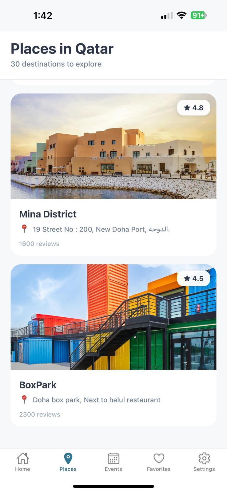
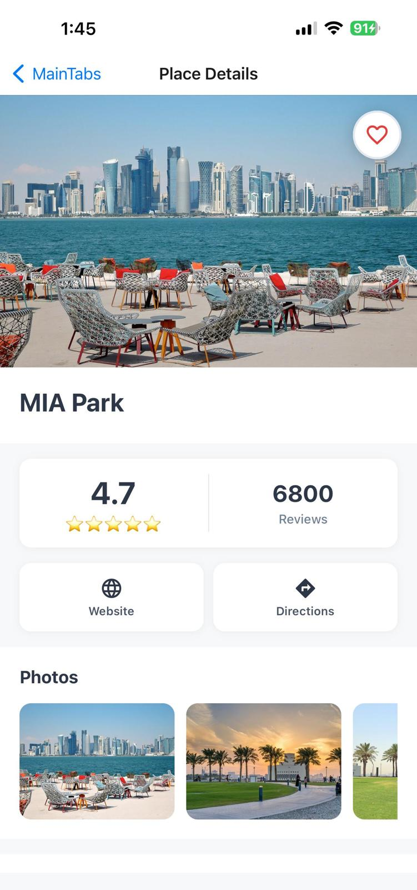

# DiscoverQA

DiscoverQA is a React Native mobile application that helps users explore Qatar by discovering popular attractions, upcoming events, and local experiences. The app provides real-time event information, interactive maps, personalized favorites, and timely notifications to enhance the tourism experience.

## Features

- Discover popular destinations across Qatar
- Browse real-time events
- Save favorite places and events
- Receive event reminders and notifications
- Interactive maps for easy navigation
- View ratings and reviews for destinations

## Tech Stack

- React Native
- Supabase
- PredictHQ API
- SerpAPI
- Google Maps API

## API Integrations

- **PredictHQ** – Real-time events and activities
- **SerpAPI** – Location and place information
- **Google Maps API** – Maps, locations, and navigation

## Getting Started

```bash
# Install dependencies
npm install

# Start Expo
npm start

# Run on Physical Device (Expo Go)
Scan the QR code displayed in the terminal or browser using the Expo Go app on your mobile device.
```

## Screens

- Home
- Explore Places
- Events
- Favorites
- Notifications
- Place Details
- Maps

## App Image

<p align="left">
  
  
</p>
